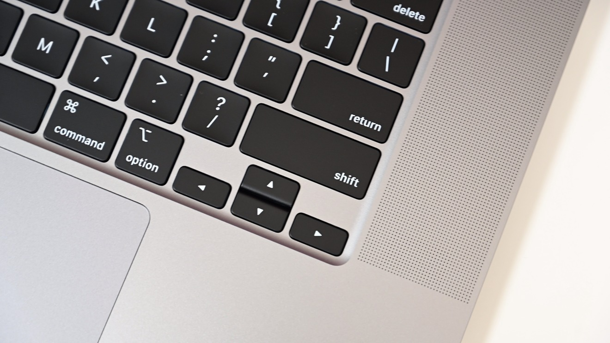

---
{
  "title": "Easier to reach arrow keys",
  "description": "Wouldn't it be nice to not have to move your entire hand to reach the arrow keys?",
  "published": "2023-11-30T20:52:31-06:00",
}
---

After going on a journey of exploring various custom mechanical keyboards I became very accustomed to accessing
my arrow keys on layer without needing to move my hands away from the home row position. This _really_ grew on me.
So much so that needing to move my hand down to the arrow keys on my laptop's keyboard started driving me nuts.

I'm pretty happy with the solution I arrived at and thought maybe it'd be worth sharing!

## Who uses the right `⌘` key anyways?

I sure don't. Well, except maybe when using `⌘[` or `⌘]`. That button is in prime real-estate and significantly
under-utilized! So I've remapped it with [Karabiner Elements](https://karabiner-elements.pqrs.org/) to change my
IJKL keys to act as arrow keys. This also allows me to still use `⌘`, `⌥` and `⇧` with my left hand as I normally
would when using arrow keys.

So nice.
