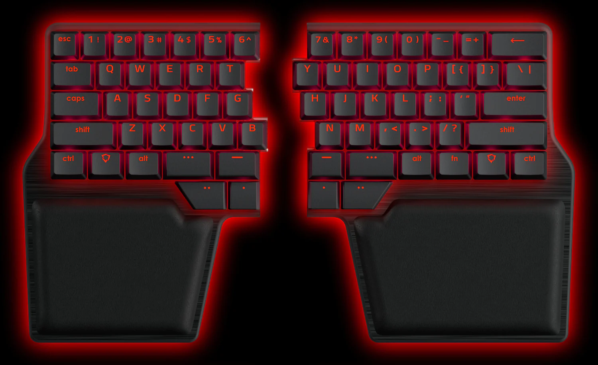

---
{
  'title': 'Meh and Hyper for normal keyboards',
  'description': "Using Meh and Hyper modifiers on a normal keyboard is difficult, but it doesn't have to be.",
  'published': '2023-09-06T10:42:38-05:00',
  'heroImage': '../../assets/laptop.jpg',
  'heroAlt': "Hands hovering over a Macbook laptop's keyboard",
}
---

## What are Meh and Hyper?

Meh (`⌃⌥⇧`) and Hyper (`⌃⌥⇧⌘`) are aliases for modifier combinations that are _so_ awkard to
hold that _almost_ no application uses them, making them great candidates for global hotkeys
you may want to set using something like [Raycast](https://www.raycast.com/).

Accessing these combinations is pretty easy on a customizable keyboard with plenty of keys on
the thumb cluster like the [Dygma Raise](https://dygma.com/products/dygma-raise), but what are
you supposed to do when you are using your laptop's built-in keyboard? Just suffer through the
same awkwardness that affords you the ability to use those as global hotkeys to begin with?



## It's time for Caps Lock to go

The Caps Lock key is _so rarely used_ and located in such prime real-estate on the keyboard.
If we bind Caps Lock as the Meh (`⌃⌥⇧`), it can be held with the left pinky and unlocks a full
keyboard of shortcuts. Additionally, it's easy to add ⌘ to the mix with the left thumb to
make it Hyper (`⌃⌥⇧⌘`) which adds another entire layer on top of that!

### The sins of the past

Ever since Apple removed the physical Escape key in favor of the touch bar I've had
Caps Lock bound to Esc, and as a Vim user that muscle memory is pretty hard to unlearn now.

After having spent some time messing around with [homerow mods](https://precondition.github.io/home-row-mods)
though when I built my [Chocofi](https://shop.beekeeb.com/product/chocofi-36-keys-kailh-low-profile-choc-v1-mechanical-ergonomic-hotswap-split-keyboard-diy-kit/) keyboard,
I knew it was possible to bind a key to do one thing when tapped, and another thing when held.

If you're not cursed with the same afflication, this solution is even better for you since you
won't even need to worry about the dual functionality.

While I ultimately ended up moving away from homerow mods because I found the them to sometimes
be problematic, I've found that it's not really a problem for me with the Escape key since I
don't really use it while typing prose. I just tap it when I need to tap it, and pretty much
never need to hold it down.

## Karabiner-Elements

[Karabiner-Elements](https://karabiner-elements.pqrs.org/) is an excellent piece of
software that lets you re-map keys for any keyboard (including the built-in one) on MacOS by
installing a virtual keyboard and intercepting real key requests to re-map them to the virtual
keyboard. I use the configuration below to achieve the desired result:

```json
{
	"description": "Caps Lock → Esc on tap, Meh on hold",
	"manipulators": [
		{
			"type": "basic",
			"from": {
				"key_code": "caps_lock"
			},
			"to": [
				{
					"key_code": "left_option",
					"modifiers": ["control", "shift"]
				}
			],
			"to_if_alone": [
				{
					"key_code": "escape"
				}
			]
		}
	]
}
```

If you don't care about using Caps Lock as Escape, then just remove the `to_if_alone` key!

## Go forth and bind keys

I found this pattern to be super useful and helps keep the muscle memory intact across
keyboards, and I hope you'll give it a shot! 💪🏻
