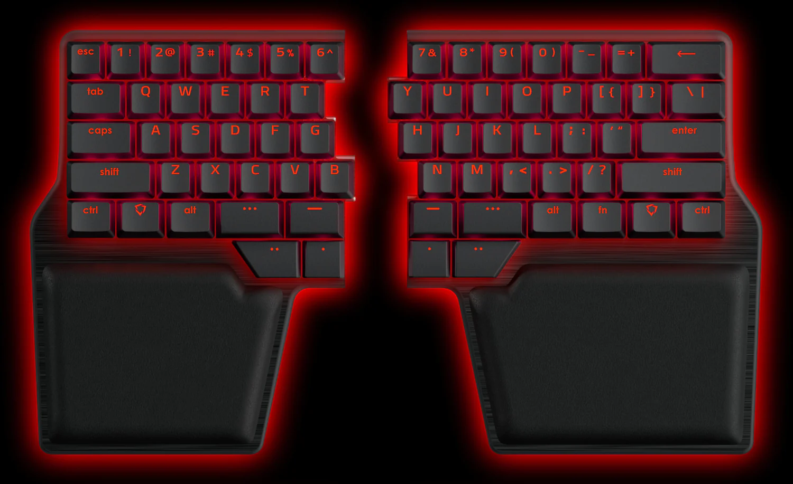

## What are Meh and Hyper?

Meh (`⌃⌥⇧`) and Hyper (`⌃⌥⇧⌘`) are super useful modifier combinations for global hotkeys
because they are unlikely to collide with any other existing shortcuts being so awkward
to hold.

This is a great use of all those fancy thumb cluster keys on something like the [Dygma
Raise](https://dygma.com/products/dygma-raise), but what are you supposed to do when you
carry around your laptop and use the laptop's keyboard? Just suffer through the same 
awkwardness that affords you the ability to use those as global hotkeys to begin with?
"Unacceptable!", I say.

Ever since Apple removed the physical Escape key in favor of the touch bar I've had
`Caps Lock` bound to `Esc`, and there's no unringing that bell — but we can do more!

## Karabiner Elements

[Karabiner Elements](https://karabiner-elements.pqrs.org/) is an excellent piece of 
software that lets you re-map keys. I've re-mapped `Caps Lock` to behave as `Esc` when
I tap it, but as `Meh` when I hold it!