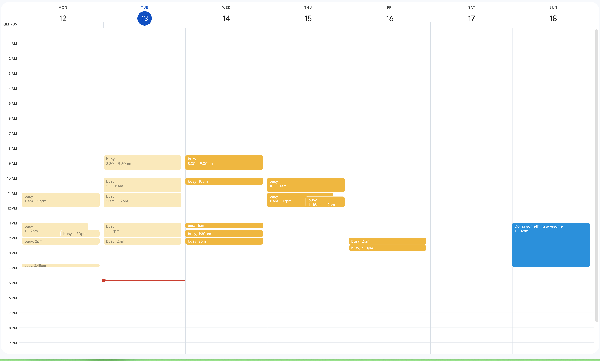

---
{
  "title": "Monday is the correct first day of the week",
  "description": "How did we decide otherwise?",
  "published": "2025-05-13T21:45:37.787Z",
}
---

## Optimizing for the future

When you look at your calendar, what % of the time are you looking forward at events yet to come, and what % of the time are you looking back at events in the past? It's pretty rare that I'm interested in past calendar events.

So I'm switching. Actually, I switched a few months ago.

I mentioned this to [Taylor Smith](https://tsmith.com/blog/), to which he replied:

> 1. I totally get it
> 2. It's objectively better
> 3. HEINOUS.

Which is fair. 😅

I'm _still_ getting used to it. It's just wild that we've all settled for only seeing half of the upcoming weekend on our calendar. **NO MORE!**
